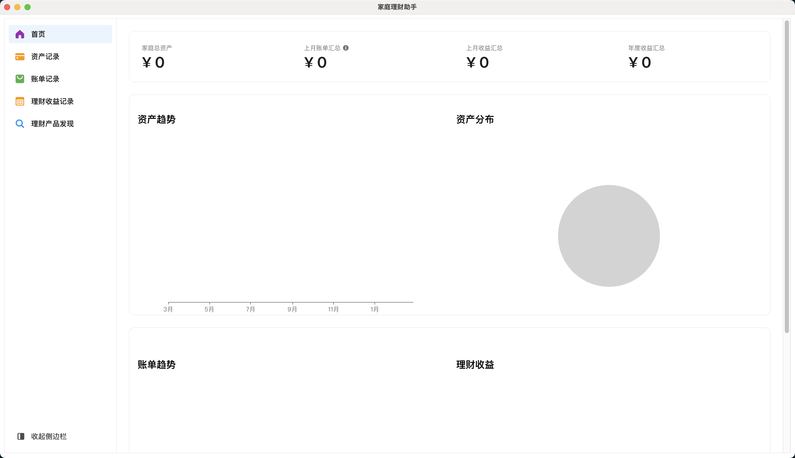

# 家庭财务助手

## Screenshot



## Install

Clone the repo and install dependencies:

```bash
npm install
```

## Starting Development

Start the app in the `dev` environment:

```bash
npm start
```

## Packaging for Production

To package apps for the local platform:

```bash
npm run package
```

分发mac 安装包

```
npm run package -- --mac
```

CI 发布包流程

1. 更新`release/app/package.json` 中的版本信息 例如：`0.2.3`
2. 在 github 发布 draft, title 为版本信息 例如：`0.2.3`
3. 创建 tag,格式为`v0.2.3` 命令：`git tag v0.2.4, git push origin v0.2.4`

## 安装问题

mac

```
sudo xattr -dr com.apple.quarantine /Applications/FinancialAssistant.app
```
